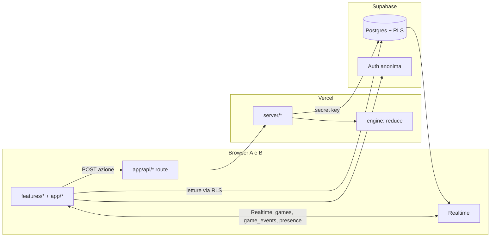

# Architettura

## Panoramica

## Livelli e regole di import

| Cartella            | Ruolo                                                                                      | Può importare                                                              | Non può importare                                                            |
| ------------------- | ------------------------------------------------------------------------------------------ | -------------------------------------------------------------------------- | ---------------------------------------------------------------------------- |
| `src/engine`        | Regole pure: tipi, `RULES`, reducer, helper del tabellone, minigiochi                      | solo sé stesso                                                             | React, Next, Supabase, `@/lib`, `@/server`, `@/features` (imposto da ESLint) |
| `src/content`       | Contenuti versionati + schemi Zod                                                          | `@/engine` (tipi), `zod`                                                   | tutto il resto                                                               |
| `src/server`        | Logica lato server: accesso, pipeline delle azioni, pesca delle domande                    | tutto tranne `@/features`                                                  | — (ogni file inizia con `import "server-only"`)                              |
| `src/lib`           | Client Supabase, env                                                                       | `@/engine`                                                                 | `admin.ts` solo da `src/server`                                              |
| `src/features`      | UI per area (tabellone, carte, lobby...)                                                   | `@/engine`, `@/content`, `@/art`, `@/components`, `@/lib/supabase/browser` | `@/server`, `@/lib/supabase/admin` (imposto da ESLint)                       |
| `src/art`           | Illustrazioni SVG e wrapper Rive                                                           | React, Motion, Rive                                                        | dati e server                                                                |
| `src/components/ui` | Componenti UI generici (bottoni, pannelli, timer)                                          | React                                                                      | logica di gioco                                                              |
| `src/app`           | Routing: pagine sottili che compongono `features`, route API sottili che chiamano `server` | tutto                                                                      | —                                                                            |

## Flusso di un'azione

1. Il client chiama `POST /api/games/[gameId]/actions` con `{ action, expectedVersion }`.
2. La route valida il body con Zod e chiama `applyAction` (`src/server/game/apply-action.ts`).
3. Il server ricava il giocatore dalla sessione (`auth.getUser()` → `player_sessions` → `players.seat`) e rifiuta
   se `action.seat` non è il suo.
4. Carica `games.state` e `games.version`; se `version ≠ expectedVersion` risponde `409` con lo stato attuale.
5. Costruisce `EngineContext`: RNG crittografico (`crypto.randomInt`), `now`, disposizione, impostazioni,
   `drawQuestion` (legge `questions`, `used_questions`, `sheet_answers`), `drawChallenge`, `checkMultipleChoice`.
6. `reduce(state, action, ctx)` → `{ ok, state, events }` oppure errore `422`.
7. In una sola transazione (funzione SQL o update condizionato): `update games set state, version = version + 1
where id and version = expected`, insert in `game_events`, insert in `used_questions` se serve.
8. Realtime notifica entrambi i client; il client che ha agito usa anche la risposta HTTP.
9. Il client anima la differenza tra stato vecchio e nuovo usando gli `events` (es. `ROLLED`, `MOVED`,
   `CLIMBED_LADDER`), non ricalcolando le regole.

**Cosa non deve mai finire nello stato o negli eventi:** le risposte della scheda, il seme del RNG.
Per le `short` la risposta data dal giocatore è nello stato (serve all'altro per giudicare); la risposta
"giusta" dell'interrogato non c'è mai.

## Motore: moduli ed eventi

`src/engine` è puro e senza I/O. Il reducer è l'unico punto d'ingresso, ma le regole sono divise per area:

| File                  | Contenuto                                                                                                     |
| --------------------- | ------------------------------------------------------------------------------------------------------------- |
| `reducer.ts`          | `createInitialState`, `reduce` (instrada le azioni), il tiro dei dadi                                         |
| `turn.ts`             | stato di lavoro `Draft`, fine turno, round e fine partita (stelle bonus, vincitore)                           |
| `resolution.ts`       | effetto della casella d'arrivo, scale e serpenti, pesca di domande e sfide, chiusura della sfida              |
| `cards.ts`            | azioni delle carte: domande, sfide (giudice, doppia conferma, disputa, timer, minigiochi), stella, imprevisti |
| `items.ts`            | acquisto, uso e scarto degli oggetti                                                                          |
| `economy.ts`          | guadagni, perdite, trasferimenti e raddoppio da 71 in su                                                      |
| `board.ts`            | coordinate a serpentina e ricerca di scale e serpenti                                                         |
| `board-validation.ts` | i sei vincoli di una disposizione valida                                                                      |
| `minigames/`          | tris, forza 4, memory: moduli puri con `init`, `applyMove`, `result`                                          |
| `testing.ts`          | **solo test**: `EngineContext` finto, disposizione di prova, partita di prova                                 |

Il reducer lavora su una copia profonda dello stato: se l'azione non è valida ritorna `{ ok: false, error }` senza
toccare nulla; se è valida aumenta `version` di uno e restituisce il nuovo stato con gli eventi prodotti.

Oltre ai campi dello stato iniziale, `GameState` porta `arrivalCell` e `handled` per la regola "scala e serpente
solo se il giocatore è ancora sulla casella d'arrivo" ([D-31](decisions.md#d-31--stato-del-motore-per-ancora-sulla-casella-darrivo)).

### Eventi

`GameEvent` è un'unione discriminata su `type` in `src/engine/types.ts`: è ciò che il client anima e il diario
racconta. Ogni evento ha `seat` (il posto a cui si riferisce, `null` per gli eventi della partita). Famiglie:

- **partita e turni:** `GAME_STARTED`, `ROUND_STARTED`, `TURN_ENDED`, `TURN_SKIPPED`, `FINISH_REACHED`, `BONUS_STARS`,
  `GAME_FINISHED`;
- **movimento e monete:** `ROLLED` (dadi, bonus rimonta, da dove a dove), `MOVED` (con `reason`), `COINS_GAINED`,
  `COINS_LOST`;
- **domande:** `QUESTION_DRAWN`, `QUESTION_ANSWERED` (la risposta data è qui, per il diario), `QUESTION_JUDGED`,
  `QUESTION_SKIPPED`;
- **sfide:** `CHALLENGE_DRAWN`, `CHALLENGE_CLAIMED`, `CHALLENGE_DISPUTED`, `CHALLENGE_RESOLVED`, `CHALLENGE_REMATCH`,
  `TIMER_EXPIRED`, `MINIGAME_STARTED`, `MINIGAME_MOVED`, `MINIGAME_FINISHED`;
- **oggetti, scale e serpenti, stella, imprevisti:** `ITEM_BOUGHT`, `ITEM_USED`, `ITEM_RECEIVED`, `ITEM_DISCARDED`,
  `ITEM_OVERFLOW`, `CLIMBED_LADDER`, `SLID_DOWN_SNAKE`, `SNAKE_BLOCKED`, `STAR_OFFERED`, `STAR_BOUGHT`,
  `STAR_DECLINED`, `EVENT_DRAWN`, `EVENT_RESOLVED`.

Nessun evento porta la risposta della scheda né il seme del RNG: l'evento `QUESTION_ANSWERED` contiene solo la
risposta **data** dal giocatore, che serve all'altro per giudicare.

## Accesso (fase 0)

1. La stanza si crea da terminale: `pnpm room:create` (codice, password, nomi dei due posti). Non c'è registrazione.
2. Pagina di accesso: il browser fa `supabase.auth.signInAnonymously()` se non ha una sessione (cookie gestiti da
   `@supabase/ssr`, refresh in `src/proxy.ts`).
3. `POST /api/rooms/join { code, password, seat }`: il server verifica la password (`scrypt`, confronto a tempo
   costante, ritardo crescente sui tentativi falliti) e inserisce `player_sessions (auth_user_id → player_id)`.
   Più dispositivi possono essere legati allo stesso posto.
4. Da quel momento RLS consente al browser di leggere solo la propria stanza e la propria scheda.
5. Uscire = cancellare la riga in `player_sessions` + `signOut`.

## Tempo reale, presenza e riconnessione

- **Stato:** il client si abbona ai cambi di `games` (riga della partita aperta) e di `game_events`.
- **Presenza:** canale Realtime `room:<roomId>` con Presence (`{ seat, screen }`); alimenta l'indicatore
  "l'altro è connesso" e `players.last_seen_at`.
- **Riconnessione:** al caricamento di qualsiasi pagina della stanza il client legge la partita aperta
  (`status in lobby | sheets | playing`) e va alla schermata della fase. Nessuno stato importante vive solo nel browser.
- **Stato della serata** (`games.status`): `lobby` → `sheets` (se una scheda è incompleta) → `playing` → `finished`.
  Una sola partita aperta per stanza (indice univoco parziale).

## Rotte

| Rotta                                      | Schermata / funzione                                                                       |
| ------------------------------------------ | ------------------------------------------------------------------------------------------ |
| `/`                                        | Accesso                                                                                    |
| `/r/[code]/lobby`                          | Lobby                                                                                      |
| `/r/[code]/sheet`                          | Scheda                                                                                     |
| `/r/[code]/game`                           | Partita (carte, pausa per sfide esterne e schermata finale sono stati della stessa pagina) |
| `/r/[code]/diary`                          | Diario e archivio                                                                          |
| `POST /api/rooms/join`                     | Accesso a un posto                                                                         |
| `POST /api/games/[gameId]/actions`         | Azione di gioco                                                                            |
| (da creare) `POST /api/rooms/[code]/games` | Nuova serata / impostazioni lobby / pronto                                                 |
| (da creare) `PUT /api/sheet/[questionId]`  | Salvataggio automatico di una risposta della scheda                                        |

## Test

- `src/engine/**`: test unitari Vitest accanto ai file (`*.test.ts`), con `EngineContext` finto e RNG deterministico.
  Ogni regola di [rules.md](rules.md) deve avere almeno un test.
- RLS: test SQL o script su Supabase locale (fase 0/2) che verificano che un giocatore non legga la scheda
  dell'altro né la tabella `rooms`.
- UI: verifica manuale con due browser (uno in incognito) su `pnpm dev`.

## Ambienti e deploy

| Ambiente   | Next.js                                    | Supabase                                                       |
| ---------- | ------------------------------------------ | -------------------------------------------------------------- |
| Locale     | `pnpm dev`                                 | `pnpm db:start` (Docker) + `pnpm db:reset` (migrazioni + seed) |
| Produzione | Vercel (progetto collegato al repo GitHub) | Progetto remoto: `pnpm supabase link`, `pnpm supabase db push` |

Variabili: vedi `.env.example`. Su Vercel si impostano le stesse tre. "Spegnibile": si mette in pausa il progetto
Supabase e si disattiva il deploy Vercel; il piano gratuito di Supabase mette in pausa da solo i progetti inattivi
da una settimana.
