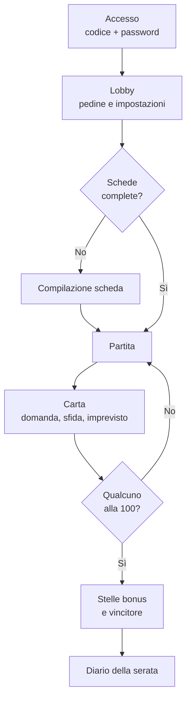
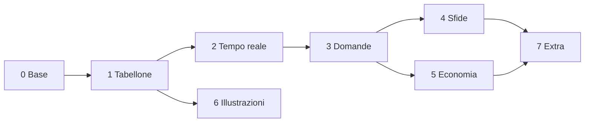

# Board Game di Coppia — Documento di progetto

2026-09-17 · @Someone

## Visione

Un gioco "scale e serpenti" digitale per due, in bianco e nero illustrato, da giocare a distanza in videochiamata: 100 caselle, ognuna un pretesto per conoscersi meglio o sfidarsi.

- **Giocatori:** 2, online insieme, in videochiamata.
- **Durata:** una serata, circa 60-90 minuti.
- **Spirito:** competitivo, vince uno dei due.
- **Riutilizzabile:** sito generico; domande, sfide e disposizione cambiano a ogni partita.
- **Uso:** privato, per due persone, ospitato su Vercel e spegnibile.
- **Reference primaria:** il tabellone "scale e serpenti" in bianco e nero con illustrazioni a tema coppia, caricato in chat.

## Regole

Si parte dalla casella 1 e si sale a serpentina fino alla 100; vince chi ha più stelle a fine partita, e arrivare per primi alla 100 ne vale tre.

**Tabellone**

- Griglia 10 × 10, caselle numerate da 1 (in basso a sinistra) a 100 (in alto a sinistra), percorso a serpentina.
- 7 scale e 6 serpenti, con posizioni che variano tra alcune disposizioni predefinite.

**Turno**

1. Oggetto (facoltativo).
2. Tiro di due dadi: si avanza della somma (2-12). Con due dadi la partita dura circa 15-20 turni a testa.
3. Effetto della casella d'arrivo.
4. Se la casella è la base di una scala o la testa di un serpente, si applica la regola sotto.

**Scale e serpenti con una svolta**

- **Scala:** si sale solo rispondendo giusto a una domanda "quanto mi conosci". Risposta sbagliata: si resta alla base.
- **Serpente:** si scende, a meno di vincere una sfida lampo (30 secondi, in videochiamata). Chi vince la sfida resta dov'è.

**Fine partita**

- La partita finisce quando un giocatore raggiunge o supera la 100 (non serve il numero esatto).
- Limite di sicurezza: 25 round; poi la partita si chiude comunque.

**Punteggio**

| Voce | Come si ottiene | Valore |
| --- | --- | --- |
| Monete | Risposte giuste, sfide vinte, caselle monete | 1-5 monete |
| Stella | Casella stella, pagando 10 monete | 1 stella |
| Arrivo | Primo alla casella 100 | 3 stelle |
| Sapientone | Più risposte giuste nella partita | 1 stella |
| Campione | Più sfide vinte nella partita | 1 stella |

A parità di stelle vince chi ha più monete.

**Rimonta:** chi è indietro di 20 o più caselle aggiunge +2 al tiro; nelle ultime 3 file (caselle 71-100) le monete valgono doppio.

**Posta in palio:** scelta a inizio serata (es. chi vince decide il film della prossima serata).

## Caselle

Il tipo di ogni casella si riconosce dalla sua forma grafica, come nella reference: niente colori, solo bianco, nero e geometria.

| Tipo | Aspetto | Effetto | Quantità |
| --- | --- | --- | --- |
| Domanda | Bianca con illustrazione | Domanda della categoria illustrata | 35 |
| Sfida | Nera piena | Minigioco tra i due giocatori | 12 |
| Imprevisto | Metà nera in diagonale | Carta evento a sorpresa | 10 |
| Monete | Con cerchio o semicerchio nero | +3 monete (o −2 se il cerchio è vuoto) | 10 |
| Stella | Illustrazione di una stella | Si può comprare una stella | 3 |
| Libera | Bianca vuota | Nessun effetto, turno veloce | 28 |
| Partenza e arrivo | Caselle 1 e 100 | Inizio e fine | 2 |

Le caselle con basi di scale e teste di serpenti possono essere di qualsiasi tipo: l'effetto della casella si applica prima di salire o scendere.

**L'illustrazione indica la categoria della domanda**

| Categoria | Illustrazioni | Esempio di domanda |
| --- | --- | --- |
| Gusti | Bottiglia, calici, vinile, chitarra | Qual è il mio piatto preferito? |
| Ricordi | Lettera, cornice, macchina da scrivere, telefono | Dove ci siamo dati il primo bacio? |
| Futuro | Anello, casa, gabbia aperta, mappa | Dove vorrei vivere tra dieci anni? |
| Profonde | Specchio, rosa nella campana, serratura | Di cosa ho più paura? |
| Buffe | Occhio, spazzolino, dado, mela | Qual è la mia abitudine più strana? |

## Domande e schede giocatore

Le risposte giuste vengono da una scheda che ognuno compila in segreto una volta sola e aggiorna quando vuole.

- **Scheda giocatore:** circa 40 domande a scelta multipla o risposta breve, divise nelle cinque categorie. Il sito chiede di completarla prima della prima partita.
- **Quanto mi conosci:** il sito mostra la domanda all'altro giocatore e confronta la risposta con la scheda.
- **Conosciamoci:** domande aperte senza risposta giusta, da discutere in videochiamata; valgono sempre 1 moneta.
- **Livelli:** le domande profonde diventano più intime salendo di fila (file basse leggere, file alte più personali).
- **Niente ripetizioni:** il sito ricorda le domande uscite e le ripropone solo a mazzo esaurito.

**Verdetto**

| Tipo di risposta | Come si decide | Monete |
| --- | --- | --- |
| Scelta multipla | Automatico, confronto con la scheda | 3 se giusta |
| Risposta breve | Chi è interrogato giudica: giusta, quasi, sbagliata | 3, 1 o 0 |
| Aperta | Nessun verdetto | 1 sempre |

**Mazzo iniziale:** circa 150 domande (30 per categoria), ampliabile nel tempo.

## Sfide

Ogni sfida è una carta con lo stesso formato (nome, categoria, durata, istruzioni, premio, verdetto); aggiungerne una vuol dire aggiungere una carta.

**Verdetti**

1. **Automatico:** minigiochi integrati, il sito aggiorna i punti.
2. **Doppia conferma:** emulatore e siti esterni; vale solo se entrambi dichiarano lo stesso vincitore. In disaccordo: rivincita lampo o lancio di moneta.
3. **Giudice:** sfide in videochiamata; valuta l'altro giocatore.

| Categoria | Esempi | Verdetto | Durata | Premio |
| --- | --- | --- | --- | --- |
| Integrati | Tris, forza 4, memory, quiz a tempo, riflessi | Automatico | 1-3 min | 3 monete |
| Videochiamata | Mimo, faccia buffa, trova un oggetto in 20 s | Giudice | 30 s-1 min | 2 monete |
| Siti esterni | Lichess blitz 3 min, skribbl.io | Doppia conferma | 5-8 min | 5 monete |
| Emulatore DS/3DS | Mario Kart: giro più veloce su una pista | Doppia conferma | 5-10 min | 5 monete |

- **Sfida lampo del serpente:** sempre una sfida in videochiamata o un minigioco da 30 secondi.
- **Filtri a inizio serata:** categorie attive e durata massima.
- **Emulatore:** per il DS la sfida è "a punteggio" (stesso livello, vince il tempo migliore), perché il multiplayer tra due browser non è praticabile; il 3DS si gioca su emulatore desktop con stanze online. Ogni giocatore carica il proprio file di gioco dal computer; nessun file viene caricato sul server.

## Oggetti e imprevisti

Ogni giocatore tiene al massimo 3 oggetti, comprati con le monete all'inizio del proprio turno o trovati negli imprevisti; se ne usa uno prima di tirare i dadi.

| Oggetto | Effetto | Prezzo (monete) |
| --- | --- | --- |
| Dado singolo | Tiri un solo dado, per muoverti piano | 3 |
| Dado truccato | Scegli il risultato di un dado | 8 |
| Salta domanda | Salti una domanda senza penalità | 4 |
| Antidoto | Ignori il prossimo serpente | 7 |
| Scala portatile | Sali alla fine della scala più vicina davanti a te | 12 |
| Ladro | Rubi 5 monete all'altro | 6 |
| Scambio | Scambi la tua posizione con l'altro | 10 |

**Imprevisti** (pescati a caso)

- Vento a favore: avanti di 5 caselle.
- Sentiero sbagliato: indietro di 5 caselle.
- Regalo: l'altro ti dà 3 monete.
- Tesoro: ricevi un oggetto a caso.
- Serpente improvviso: scendi al serpente più vicino dietro di te, se c'è.
- Scala fortunata: sali alla scala più vicina davanti a te, senza domanda.
- Pausa ghiotta: entrambi prendete uno snack, 2 minuti di pausa, nessun effetto.

## Estetica

Bianco e nero puro, come la reference primaria: illustrazioni piatte a tratto spesso e campiture nere, a tema coppia, su una griglia con geometrie nere. Il colore compare solo sulle pedine, per distinguere i due giocatori.

**Elementi dalla reference**

- **Griglia:** celle quadrate con bordi sottili, cornice nera spessa con angoli arrotondati, numeri piccoli in alto a sinistra.
- **Geometrie:** celle nere piene, triangoli in diagonale, cerchi e semicerchi che occupano più celle.
- **Scale:** montanti neri spessi, pioli bianchi bordati di nero.
- **Serpenti:** corpo nero o bianco con motivo a macchie, testa con occhio, sinuosi su più celle.
- **Illustrazioni:** oggetti e scene romantiche disegnati a linea con parti nere piene (anello, lettere, calici, rosa, specchio, clessidra, vasca, disco).

**Palette**

| Ruolo | Colore | Hex |
| --- | --- | --- |
| Fondo celle | Bianco carta | #F2F2F0 |
| Inchiostro, cornice, celle piene | Nero | #1A1A1A |
| Giocatore 1 | Rosso | #D83B2C |
| Giocatore 2 | Blu | #2F4B9E |

**Tipografia:** titoli in Playfair Display corsivo nero; numeri e testo in un sans pulito (es. Space Grotesk).

**Pedine:** teste piatte di animali in bianco e nero (volpe, coniglio, gatto, orso, rana, gufo) su un gettone del colore del giocatore.

**Mascotte delle reazioni:** le sei forme con occhi grandi, ridisegnate in bianco e nero; compaiono nel pannello laterale, mai sul tabellone.

**Illustrazioni necessarie:** circa 45 disegni unici (35 domande, 3 stelle, alcune decorazioni), più scale, serpenti e pedine. Le celle geometriche non richiedono disegni.

**Animazioni:** dadi che rotolano, pedina che salta casella per casella, salita lungo la scala, discesa lungo il serpente, carta che si gira, mascotte che cambia espressione.

**Suoni:** opzionali, disattivabili.

## Schermate e flusso

Ogni serata segue le stesse fasi; se la pagina si ricarica o la connessione cade, il sito riprende dalla fase salvata.

| Schermata | Contenuto |
| --- | --- |
| Accesso | Codice stanza, password, stato dell'altro giocatore (connesso o no) |
| Lobby | Scelta pedina e colore, disposizione del tabellone, categorie di sfida, durata massima, posta in palio; si parte quando entrambi sono pronti |
| Scheda | Domande private a blocchi, salvataggio automatico |
| Partita | Tabellone a sinistra; a destra turno, punteggi, oggetti, carta attiva e pulsante dei dadi |
| Carta | Domanda con risposte, sfida con istruzioni e timer, imprevisto con effetto |
| Pausa sfida esterna | Link o emulatore, timer, al ritorno "Chi ha vinto?" con doppia conferma |
| Fine | Rivelazione delle stelle bonus una alla volta, vincitore, posta in palio |
| Diario | Riepilogo di risposte, sfide e momenti; archivio delle partite passate |

## Architettura tecnica e dati

Frontend su Vercel, stato condiviso e dati su Supabase: Vercel non tiene connessioni persistenti, Supabase offre database, sincronizzazione in tempo reale e accesso in un unico servizio gratuito.

| Componente | Scelta | Ruolo |
| --- | --- | --- |
| Frontend | Next.js su Vercel | Interfaccia, tabellone in SVG, minigiochi |
| Tempo reale | Supabase Realtime | Mosse e stato visibili subito a entrambi |
| Database | Supabase (Postgres) | Schede, domande, partite, diario |
| Accesso | Stanza con codice + password | Solo i due giocatori entrano |
| Emulatore DS | Emulatore web nel browser | Sfide a punteggio, file caricato localmente |
| Videochiamata | App esterna già in uso | Voce e video |

**Principio:** le regole girano in un solo punto (una funzione che riceve lo stato e l'azione e restituisce il nuovo stato), così i due schermi non vanno mai fuori sincrono.

**Dati**

| Tabella | Contenuto |
| --- | --- |
| stanze | Codice, password cifrata, giocatori |
| giocatori | Nome, pedina, colore |
| schede | Risposte private di ogni giocatore |
| domande | Testo, categoria, livello, tipo di risposta |
| domande\_usate | Domande già uscite per la coppia |
| sfide | Carte sfida con categoria, durata, premio, verdetto |
| tabelloni | Disposizioni: 100 celle (tipo, illustrazione), scale e serpenti |
| partite | Stato corrente (posizioni, monete, stelle, oggetti, turno, carta attiva) |
| eventi | Registro di ogni mossa e risultato, usato per il diario |

**Illustrazioni:** componenti SVG, così restano nitide, leggere e animabili.

## Piano di sviluppo

Sette fasi; dopo la fase 3 c'è già una prima serata giocabile, il resto si aggiunge tra una partita e l'altra.

| Fase | Contenuto | Risultato |
| --- | --- | --- |
| 0. Base | Progetto Next.js, Vercel, Supabase, stanze con password | Entrambi entrano nella stessa stanza |
| 1. Tabellone | Griglia 100 caselle, due dadi, pedine, scale, serpenti, turni, fine partita | Partita completa su un solo schermo |
| 2. Tempo reale | Stato condiviso, riconnessione, indicatore dell'altro giocatore | Partita a distanza sincronizzata |
| 3. Domande | Schede, mazzo iniziale da 150 domande, verdetti, regola delle scale | **Prima serata giocabile** |
| 4. Sfide | Carte, doppia conferma, tris, forza 4, memory, link Lichess e skribbl.io, sfida lampo | Sfide in tutte e quattro le categorie tranne l'emulatore |
| 5. Economia | Monete, stelle, oggetti, imprevisti, rimonta, stelle bonus, diario | Regole complete |
| 6. Illustrazioni | 45 disegni, scale, serpenti, pedine, mascotte, animazioni | Estetica finale |
| 7. Extra | Emulatore DS, altre disposizioni del tabellone, bilanciamento dopo le prime partite | Versione rifinita |

Le illustrazioni (fase 6) possono procedere in parallelo già dalla fase 1: il tabellone parte con segnaposto geometrici e i disegni li sostituiscono man mano.

## Decisioni aperte

Risolte il 2026-09-17: vedi [decisions.md](decisions.md), che prevale su questo documento.

- [x] Due dadi o uno solo → due dadi ([D-04](decisions.md#d-04--due-dadi)).
- [x] Colori dei due giocatori → rosso e blu di default, scelta in lobby tra quattro colori ([D-20](decisions.md#d-20--font-e-colori)).
- [x] Font del testo → Space Grotesk ([D-20](decisions.md#d-20--font-e-colori)).
- [ ] Elenco dei giochi DS/3DS posseduti e regole di ogni sfida (fase 7).
- [ ] Prime domande della scheda e del mazzo, per categoria → formato deciso ([content.md](content.md)), contenuti nel task F3-04.
- [ ] Posizioni di scale e serpenti nella prima disposizione → task F1-01.
- [x] Conferma di Next.js e Supabase come base tecnica ([D-01](decisions.md#d-01--stack-nextjs--supabase--pnpm)).
